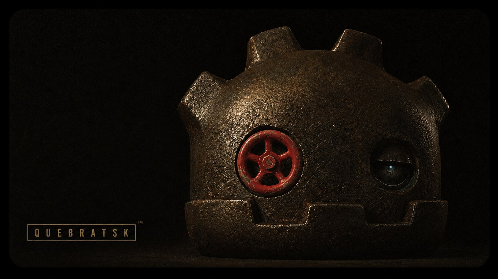
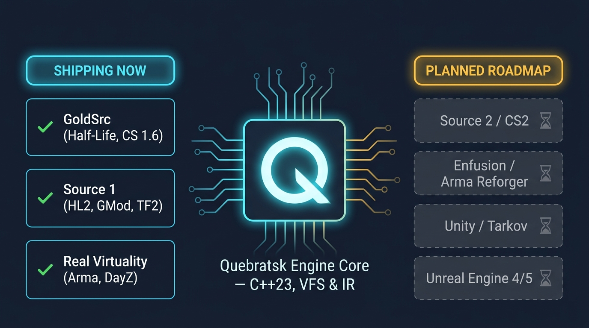

<p align="center">
  
</p>

<h1 align="center">Quebratsk Engine</h1>

<p align="center">
  Import Half-Life, Counter-Strike, Half-Life 2 and Garry's Mod assets into Godot 4
  straight from the installed game. There is no extraction step, no conversion tool, and no
  round-trip through Blender.
</p>

<p align="center">
  <a href="LICENSE"></a>
  <a href="https://godotengine.org"></a>
  <a href="https://en.cppreference.com/w/cpp/23"></a>
  <a href="../../actions/workflows/build.yml"></a>
  <a href="docs/TUTORIAL.md"></a>
</p>

---

## What it does

Point it at a game you own. It mounts that game's archives where they already sit, then
lets you search them by name and drop a model or a map into your scene. A Half-Life 2
install is roughly 100,000 files spread across 70 VPK archives, and Quebratsk copies none
of them.

<p align="center">
  
</p>

The usual route for legacy game assets runs through a chain of one-off community tools and
then hours in Blender, fixing UVs, winding order, Z-up axes and proprietary texture
formats. Quebratsk reads the formats directly in C++ and hands Godot a finished
`ArrayMesh`, `Skeleton3D` and `StandardMaterial3D`.

Two things it gets right that most converters miss:

Models arrive in a pose the game actually uses. A bind pose is a modelling artefact players
never see. Quebratsk decodes the animation sequences, including the external `.ani` blocks
that a Garry's Mod player model borrows from a shared 7 MB animation model, and offers all
426 stances. Ask for a sequence by name and it comes in moving, on an AnimationPlayer,
instead of frozen on one frame.

Companion files resolve themselves. A Source `.mdl` holds no vertex data at all; that lives
in a `.vvd` and a `.dx90.vtx` beside it. You name one file and get a complete model.

## Why this exists

Half-Life shipped in 1998. Counter-Strike started as a mod for it a year later. In the
decades since, people have built an enormous amount of work on top of those engines:
character models, maps, weapons, sound packs, animation sets. Most of it was made by
hobbyists, given away, and is still sitting on Workshop pages and mod sites right now.

Almost none of it is reachable from a modern engine without real effort. The formats are
undocumented or documented only by the people who reverse-engineered them. The tools that
read those formats are scattered, often abandoned, and usually target one game each. So a
Godot developer who wants a crowbar or a de_dust wall texture either spends an evening in
Blender or gives up.

That gap is what this project is for. Mount the game, search for the thing, put it in your
scene. Someone learning Godot should be able to build a level out of assets they grew up
with, and a modder should be able to carry twenty years of their own work forward instead
of leaving it behind with the engine it was made for.

The formats already supported cover the games with the deepest modding histories. The
roadmap below is the rest of them.

## Install

1. Download the latest archive from [Releases](../../releases).
2. Extract it into your Godot 4 project root, so you end up with `res://bin/` and
   `res://addons/quebratsk_editor/`.
3. Re-open the project.
4. Go to Project, then Project Settings, then Plugins, and enable "Quebratsk Engine".
5. Open the Quebratsk tab in the left dock and press "Add a game".

Requires Godot 4.3 or newer, Windows x86_64.

New to Godot? Start with the [beginner's guide](docs/TUTORIAL.md).

## From code

The dock is a thin layer over an API you can drive yourself. Full reference lives in
[docs/API.md](docs/API.md).

```gdscript
var vfs := VFSManager.new()
add_child(vfs)

var importer := UnifiedAssetImporter.new()
add_child(importer)
importer.set_vfs(vfs)

# Mount the _dir.vpk only. It pulls in its own numbered side archives.
vfs.mount_container("hl2", "C:/.../half-life 2/hl2/hl2_misc_dir.vpk")

for path in vfs.list_files("vfs://hl2/models/"):
    print(path)

var npc := importer.load_model("vfs://hl2/models/police.mdl", "idle_smg1")
add_child(npc)
print(npc.get_meta("quebratsk_poses"))   # every stance this model can hold

# Or bring a sequence in as something that plays.
var walker := importer.load_model("vfs://hl2/models/police.mdl", "",
                                  PackedStringArray(["walk_all"]))
add_child(walker)
walker.get_node("AnimationPlayer").play("walk_all")
```

## Supported formats

Everything below has been run against retail game installs in Godot 4.7.1, by the harnesses
in `demo/tests/`. Nothing gets listed here until it works end to end.

| Engine | Archives | Models | Maps | Textures |
|---|---|---|---|---|
| GoldSrc <br/><sub>Half-Life, Counter-Strike 1.6</sub> | `.wad` (WAD3) | `.mdl` (StudioMDL v10) with geometry, skinning and `T.mdl` textures | `.bsp` (BSP30) with geometry, UVs, per-face normals, embedded and WAD textures | WAD3 lumps, `.spr` |
| Source 1 <br/><sub>Half-Life 2, Garry's Mod, CS:S, TF2</sub> | `.vpk` v1 and v2 with side archives, `.gma` | `.mdl` v44 to v49 plus `.vvd` and `.vtx`: geometry, skinning, playable animation, external `.ani`, `includemodel` | `.bsp` (BSP30) | `.vtf` (DXT1/BC1, DXT5/BC3, uncompressed), `.vmt` |
| Real Virtuality <br/><sub>Arma, DayZ</sub> | `.pbo` | not yet | `.wrp` heightmaps | not yet |

Sounds come out of any mounted game: `.wav` is decoded here, `.mp3` and `.ogg` are handed
to Godot's own importers untouched. Verified against 9,465 WAV and 338 MP3 files across
Half-Life 2 and Garry's Mod. Neither game ships an `.ogg`, so that one path is written but
has not been run against real data.

Not supported: Real Virtuality models (`.p3d`, both MLOD and ODOL) and textures (`.paa`),
Source 2 (`.vmdl_c`), Bohemia Enfusion (`.pak`, `.xob`), Unity (`.bundle`), and Unreal
Engine (`.uasset`, `.pak`).

Earlier versions of this README listed those as done, and the project shipped classes named
after them that returned an empty mesh with a material name attached. Those classes were
deleted in 2.0. The [changelog](CHANGELOG.md) has the details.

## Building

Windows, Visual Studio 2022, CMake. godot-cpp is fetched automatically.

```bash
cmake -S . -B build
cmake --build build --config Debug
```

Debug and Release need separate build trees. godot-cpp 4.3 reads `CMAKE_BUILD_TYPE`, which
is empty under a multi-config generator, so it falls back to Debug and bakes `/MDd` into
what you asked to be a release build:

```bash
cmake -S . -B build-release -DCMAKE_BUILD_TYPE=Release
cmake --build build-release --config Release
```

Both write the extension into `demo/bin/`, where `quebratsk.gdextension` expects to find
it. A fresh clone contains no compiled binary, so build before opening `demo/` in Godot.

## Testing

```bash
cd build && ctest -C Debug --output-on-failure
```

Five suites, no framework. Each is a plain executable that prints its checks and exits
non-zero on failure. Between them they cover the bounds-checked reader against adversarial
overflow, DXT block decoding, the quantised animation formats and their run-length tracks,
and the GoldSrc and Source model pipelines.

Unit tests are not the whole story, because most of the defects this project has actually
hit were not the kind a unit test finds. `demo/tests/` holds harnesses that drive the real
API and the real dock against a Steam install and print what every call returns:

```bash
godot --headless --path demo res://tests/verify_api.tscn
godot --headless --path demo res://tests/verify_dock.tscn
```

## Repository layout

```
src/                        C++ engine: parsers, VFS, converters, GDScript API
tests/                      C++ test suites, run by ctest
demo/                       Godot project that loads the extension and hosts the addon
  addons/quebratsk_editor/    the plugin users install
  tests/                      end-to-end harnesses against real game installs
docs/                       API reference and beginner's guide
```

## Roadmap

<p align="center">
  
</p>

The goal is full coverage of the engines in that diagram. The left column imports today.
The right column is where the work is going, and none of it is implemented yet. This list
says so plainly instead of shipping a class named after a format that returns nothing.

Shipping now:

- GoldSrc: archives, maps, models, textures
- Source 1: VPK and GMA archives, maps, models with skinning, playable animation, VTF/VMT
- Real Virtuality: PBO archives, WRP terrain
- Sounds: found, played in the dock, placed as an `AudioStreamPlayer3D` and written back
  into your project as the audio file they already are
- The editor plugin, which browses by category and imports without writing code

### Next

Finishing what is already half-built, in roughly this order:

| | Why it is next |
|---|---|
| Real Virtuality models, `.p3d` MLOD then ODOL | The archive and terrain half already works, so Arma and DayZ are one format away from complete |
| Real Virtuality textures, `.paa` | DXT decoding is already in the engine, so this is mostly container work |
| Source 2, `.vmdl_c` and `.vtex_c` (CS2, Half-Life: Alyx) | The VPK v2 reader is already shared with Source 1 |

### Two engines worth going after next

Everything above extends what this already does. These two open catalogues it cannot touch
at all, and both are a better fit for the era this project cares about than another
shooter would be.

**RenderWare: Grand Theft Auto III, Vice City and San Andreas.** San Andreas alone is
tens of thousands of assets: pedestrians, hundreds of vehicles, an entire state's worth of
buildings and terrain, and twenty years of a modding scene that never stopped. The formats
are chunked, unencrypted and thoroughly documented, which makes this the largest catalogue
per unit of work anywhere on this list.

| | |
|---|---|
| `.img` | Archive. San Andreas uses version 2 with the directory inside; III and Vice City keep a separate `.dir` |
| `.dff` | Models, as RenderWare clumps: geometry, skinning, hierarchy |
| `.txd` | Texture dictionaries, DXT1/DXT3 and palettised, and the DXT decoder already exists here |
| `.col` | Collision meshes, COL1 through COL3 |
| `.ifp` | Skeletal animation, which the animation work above is the groundwork for |
| `.ide` / `.ipl` | What objects exist, and where they are placed in the world |

**Torque3D: BeamNG.drive.** Unusually open for a commercial game: its content ships as
ordinary ZIP archives with nothing encrypted, and the vehicle definitions are readable
text. It is also the only entry here with real *physics* data rather than just art.

| | |
|---|---|
| ZIP mounting | Vehicles and levels are plain `.zip` under `content/`. The VFS already declares Deflate; this is the container it was meant for |
| `.cdae` and `.dae` | Meshes, compiled and source COLLADA |
| `.jbeam` | The soft-body node and beam definitions, the part that makes a BeamNG car a BeamNG car. Text, so this is a parser rather than a decoder |
| `.dds` | Textures, already decodable |
| `.ter` | Terrain heightmaps |

### Later

| | |
|---|---|
| RAGE, `.rpf` v3 (Grand Theft Auto IV) | Paged resource files (`.wdr`, `.wtd`, `.wbn`), a real step up in difficulty from RenderWare |
| RAGE, `.rpf` v7 (Grand Theft Auto V) | The archives are AES-encrypted and the keys live in the game executable. Worth being clear that this is the one entry on the list whose obstacle is not technical |
| Bohemia Enfusion, `.pak` and `.xob` (Arma Reforger) | |
| Unity, `.bundle` (UnityFS) | |
| Unreal Engine 4 and 5, `.pak` and `.uasset` | |
| Linux and macOS binaries | The C++ is portable. Only the build and CI are Windows-only today |

Progress is tracked in the [changelog](CHANGELOG.md). A format moves from planned to
shipping once it has been run against a retail game install, not when its parser compiles.

## Contributing

See [CONTRIBUTING.md](CONTRIBUTING.md) for the build and test workflow. If you are adding a
parser, the one rule that matters is the last paragraph above.

## License

MIT. See [LICENSE](LICENSE).

This project ships no game content. It reads files you already own, from where you already
have them installed. What you may then do with an imported asset is governed by each game's
own EULA, and redistributing one in a commercial project generally is not allowed.
