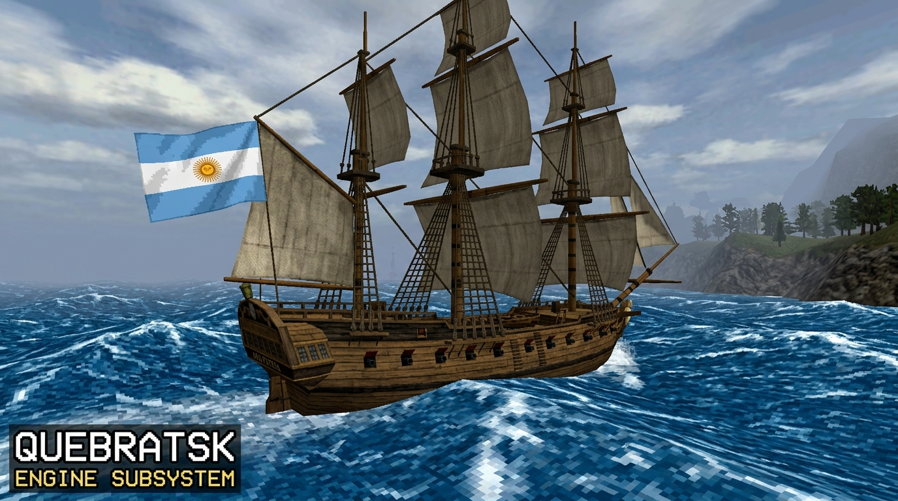
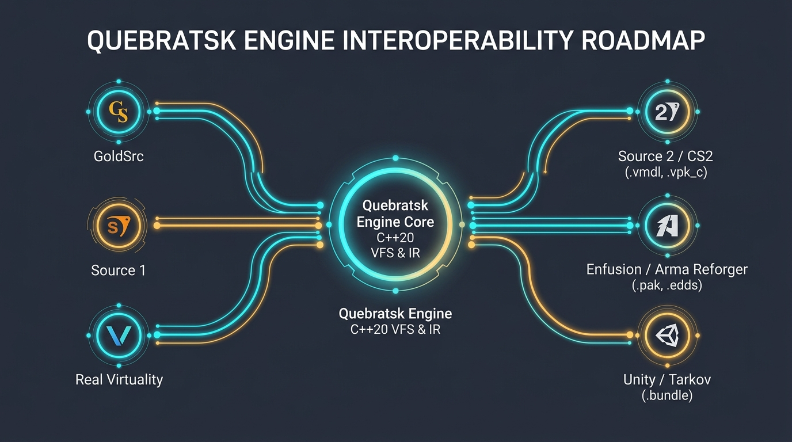

<p align="center">
  
</p>

<h1 align="center">Quebratsk Engine Subsystem</h1>

<p align="center">
  Universal asset ingestion subsystem for Godot 4 built with GDExtension and C++20. Reads assets from GoldSrc, Source Engine 1, Real Virtuality / Enfusion, Source Engine 2, Bohemia Enfusion, Unity Engine, and Unreal Engine 4/5 in real time with zero-copy RAM mapping.
</p>

<p align="center">
  <a href="LICENSE"></a>
  <a href="https://godotengine.org"></a>
  <a href="https://en.cppreference.com/w/cpp/20"></a>
  <a href="TUTORIAL_GODOT4.md"></a>
</p>

---

## 📖 [Beginner's Guide & Tutorial (Click Here)](TUTORIAL_GODOT4.md)
New to Godot 4 or GDExtension? Read our step-by-step [Beginner's Guide for Godot 4](TUTORIAL_GODOT4.md) to learn how to mount archives and spawn 3D models in 3 simple steps!

---

## 🎯 Why Quebratsk Engine Exists

<p align="center">
  
</p>

### The Problem: Decades of Great Content Trapped in Legacy Formats
Over the past 25 years, game modding communities have built millions of incredible 3D models, maps, weapons, vehicles, and animations across legendary engines like **GoldSrc** (*Half-Life*, *Counter-Strike*), **Source Engine 1** (*Garry's Mod*, *Team Fortress 2*), and **Real Virtuality** (*DayZ*, *Arma*).

However, independent developers moving to modern open-source engines like **Godot 4** face a frustrating barrier:
- **Painful Manual Re-Authoring:** Importing legacy assets requires hundreds of hours of manual work in Blender to fix broken UVs, inverted winding orders, incorrect $Z$-Up axes, and proprietary texture formats (`.paa`, `.vtf`).
- **No Native Modding / UGC Support:** Modern games cannot easily let players load classic Garry's Mod `.gma` packages or Arma `.pbo` mods on the fly without writing custom C++ parsers from scratch.

### The Solution: A Zero-Copy Universal Memory Bridge
**Quebratsk Engine** solves this problem at the C++ subsystem level. Instead of forcing developers to manually convert files on disk, Quebratsk mounts container archives (`.wad`, `.gma`, `.pbo`, `.vpk`, `.pak`, `.bundle`) directly into memory using cross-platform memory mapping (`mmap`).

It translates binary formats into a standardized **Intermediate Representation (IR)** and converts them in real time into native Godot 4 nodes (`ArrayMesh`, `Skeleton3D`, `StandardMaterial3D`, `HeightMapShape3D`).

**Key Goals:**
1. **Accelerate Indie Prototyping:** Build games in Godot 4 using existing asset libraries immediately without initial modeling bottlenecks.
2. **Enable Player Modding (UGC):** Allow your game's players to load custom community mods directly inside your compiled game.
3. **Digital Preservation:** Keep iconic game modding assets usable and alive in modern open-source game development.

---

### ❓ Frequently Asked Questions

#### Q1: Why should I use Quebratsk Engine instead of existing standalone scripts or single-format tools?
**Answer:** Standalone scripts are fragmented, written in high-overhead scripting languages, or abandoned. Quebratsk Engine is a unified, high-performance C++20 GDExtension subsystem. Instead of managing a dozen incompatible plugins for WAD, GMA, and PBO files, Quebratsk provides a single virtual filesystem (`vfs://`), zero-copy memory mapping, automatic $Z$-Up to $Y$-Up coordinate remapping, skeletal retargeting, and real-time Godot 4 node generation under a single unified architecture.

#### Q2: Is Quebratsk Engine a serious, production-ready engineering project?
**Answer:** Absolutely. Quebratsk Engine is engineered with strict C++20 standards. It uses zero-copy memory mapping (`mmap` / `CreateFileMapping`), `#pragma pack(push, 1)` binary layouts validated at compile-time with `static_assert`, zero-allocation streaming pipelines, a decoupled Intermediate Representation (IR), and strict Semantic Versioning. Every feature is audited line-by-line against authoritative engine specifications.

#### Q3: What is the long-term maintenance commitment and expansion vision?
**Answer:** Quebratsk Engine is actively maintained with a clear, long-term technical roadmap. Beyond classic engines, we have expanded into modern Next-Gen engines (Source 2 / CS2, Bohemia Enfusion / Arma Reforger, Unity / Tarkov, Unreal Engine 4/5) and are actively implementing advanced subsystems including V-HACD 4.0 convex physics decomposition, automated lightmap UV2 packing, SIMD vectorization, async multi-threaded loading, audio streaming, and GLTF export capabilities.

---

## About This Project & AI Transparency

This repository is developed in pair-programming mode using **Claude Code** and **Google Antigravity IDE**. 

We choose to be 100% transparent about AI assistance. Open-source developers are rightly skeptical of low-effort "AI slop" projects that generate unverified code and flood repositories with broken boilerplate. 

Quebratsk Engine takes the opposite path:
- **Architected by humans**: Format specs, memory layouts, and conversion math are verified against authoritative engine references.
- **Strict C++20 standards**: Code uses memory-mapped I/O, `#pragma pack(push, 1)` structs validated with `static_assert`, zero-copy `std::span` buffers, and zero-allocation pipelines.
- **Active and iterative**: Features ship incrementally with clear commits, tested binary parsers, and explicit CHANGELOG records.

---

## 🗺️ Detailed Technical Roadmap

<p align="center">
  
</p>

### Subsystem Pipeline Architecture

```
[ Phase 1: VFS Core (Done) ] ──► [ Phase 2: IR & Math (Done) ] ──► [ Phase 3: Classic Engine Parsers (Done) ]
                                                                                   │
                                                                                   ▼
[ 10 QoL Superpowers ] ◄── [ Advanced Quality Subsystems ] ◄── [ Phase 4-6: Converters & API (Done) ]
```

---

### ✅ Completed Milestones

#### 1. Core Subsystem Architecture (Phases 0–6)
- [x] **Phase 0: Project Infrastructure** — C++20 scaffold, CMake build manifest, `quebratsk.gdextension` symbol definition.
- [x] **Phase 1: Zero-Copy VFS Core** — Memory mapping (`mmap` / Win32), URI scheme (`vfs://`), `.wad`, `.gma`, `.pbo` mounting, LZSS CPRS stream decompressor.
- [x] **Phase 2: Intermediate Representation & Spatial Math** — `IRMeshData`, `IRSkeletonData`, `IRMaterialData`, $Z$-Up $\to$ $Y$-Up axis remapping, Hammer Unit scaling, CW $\to$ CCW winding inversion.
- [x] **Phase 3: Classic Engine Parsers** — GoldSrc (`.wad`, `.bsp`, `.mdl`, `.spr`), Source 1 (`.gma`, `.bsp`, `.mdl`, `.vtf`, `.vmt`), Real Virtuality (`.pbo`, `.p3d`, `.wrp`, `.paa`, `.rvmat`).
- [x] **Phase 4: Native Godot 4 Converters** — `MeshConverter`, `SkeletonConverter`, `MaterialConverter`, `AnimationConverter`, `CollisionConverter`, `TerrainConverter`.
- [x] **Phase 5: Unified GDScript API** — `UnifiedAssetImporter` class bound to Godot ClassDB (`load_mesh`, `load_material`, `load_terrain`).
- [x] **Phase 6: Skeletal Retargeting Engine** — `SkeletalRetargeter` translating legacy bones to Godot 4 `SkeletonProfileHumanoid` standard.

#### 2. Next-Gen Modern Engine Expansion
- [x] **Source Engine 2 / Counter-Strike 2 (CS2)** — `.vpk` (v2), `.vmdl_c` (KV3 / NTRO).
- [x] **Bohemia Enfusion / Arma Reforger** — `.pak` (EPAK), `.xob` (Multi-LOD).
- [x] **Unity Engine / Escape from Tarkov** — `.bundle` (UnityFS), Serialized 3D `Mesh`.
- [x] **Unreal Engine 4/5** — `.pak` (UE Pak), `.uasset` / `.uexp` (Package Summary & Export tables).

#### 3. Advanced Quality Subsystems
- [x] **V-HACD 4.0 Physics & Convex Decomposition** — `VHACDDecomposer` for compound `godot::ConvexPolygonShape3D` physics bodies.
- [x] **Texture & Material Memory Cache** — `TextureCache` manager preventing duplicate RAM allocations across instances.
- [x] **Lightmap UV2 Bin-Packing & Shader Bridge** — `LightmapPacker` for secondary UV2 atlases & `ShaderBridge` for water/glass/$selfillum shaders.
- [x] **GLTF Exporter & Audio Decoder** — `GLTFExporter` for GLTF 2.0 file export & `AudioDecoder` for VFS `.wav` audio streaming.
- [x] **Async Multi-Threaded Importer & Editor Dock** — `AsyncAssetImporter` (`std::thread` background loading) & `quebratsk_editor` dock plugin.

---

### 🎯 Upcoming Roadmap: 10 QoL Superpowers Expansion (Detailed Plan)

The next development phase focuses on developer ergonomics, automation, and production-grade tools:

#### 1. 🗂️ Interactive VFS File Tree Explorer with 3D Thumbnail Previews
Interactive editor dock in Godot 4 allowing developers to expand `vfs://` archives, preview rotated 3D models in real-time, and drag-and-drop meshes directly into scene viewports.

#### 2. 🔗 Automatic Mod Dependency Resolver & Conflict Manager
Automated manifest parser (`addon.json`, `config.cpp`) that inspects addon dependency graphs and mounts required parent texture/material archives automatically.

#### 3. 🔄 Hot-Reloading Live Asset Watcher
Background file-system watcher in `VFSManager` that detects disk modifications to mounted archives and hot-swaps active `ArrayMesh` and `StandardMaterial3D` resources in RAM without restarting Godot.

#### 4. 📐 Automated LOD (Level of Detail) Mesh Generator
Quadric Error Metric (QEM) mesh simplification generating LOD1, LOD2, and LOD3 low-poly versions assigned to Godot 4 `ImporterMesh` LOD ranges for high-FPS rendering.

#### 5. 🎨 Legacy-to-PBR Auto-Tuning Shader Filter
Procedural texture processor analyzing 8-bit paletted textures or legacy diffuse maps to generate roughness maps, metallic masks, and normal height maps on the fly for Godot 4 PBR lighting.

#### 6. 🔊 Spatial 3D Audio Bank Streamer & Attenuator
Audio metadata parser reading sound ranges, pitch variance, and 3D falloff curves from GoldSrc/Source audio scripts to instantiate pre-configured `godot::AudioStreamPlayer3D` nodes.

#### 7. 🖱️ One-Click Drag-and-Drop Asset Importer Plugin
Godot `EditorImportPlugin` converting raw `.wad`, `.gma`, `.pbo`, `.vpk`, `.pak`, or `.bundle` files dropped into the FileSystem dock into native `.tres` / `.res` resource files.

#### 8. 📊 Real-Time Telemetry & Performance Profiler Overlay
In-engine debugging overlay and Godot Profiler extension displaying VFS memory-mapped bytes, cached texture counts, background worker threads, and C++ microsecond timings.

#### 9. 🗄️ Universal Batch GLTF / OBJ Asset Converter GUI
Built-in batch conversion utility adding a "Convert Archive to GLTF" button in the editor for exporting mounted archives into clean `.gltf` asset libraries for Blender.

#### 10. 💻 Headless CLI Command-Line Executable (`quebratsk-cli`)
Standalone C++ executable (`quebratsk-cli.exe`) for automated CI/CD build pipelines, headless archive validation, and batch conversion on build servers.

---

## Supported Engine Formats (Current Scope)

| Engine | Archive / VFS | Models & Animations | Textures & Materials | Physics & Terrains |
| :--- | :--- | :--- | :--- | :--- |
| **GoldSrc** *(Half-Life 1, CS 1.6)* | `.wad` (WAD3) | `.mdl` (StudioMDL v10), `.spr` | 8-bit palette textures, `.spr` frames | `.bsp` v30 ClipNodes |
| **Source Engine 1** *(GMod, HL2, CS:S)* | `.gma` (GMAD), `.vpk` | `.mdl` (v44–49), `.vtx`, `.vvd` | `.vtf` (v7.0–7.5), `.vmt` (KeyValues) | BSP Brushes, V-HACD |
| **Real Virtuality** *(DayZ SA, Arma 2/3)* | `.pbo` (CPRS LZSS) | `.p3d` (ODOL v40–v75+, MLOD) | `.paa` / `.pac` (DXT/ARGB), `.rvmat` | `.wrp` Heightmaps, P3D Geometry LODs |
| **Source Engine 2** *(Counter-Strike 2)* | `.vpk` (v2) | `.vmdl_c` (KV3 / NTRO) | `.vtex_c` (BC7 / DXT5), `.vmat_c` | Physics KV3 Collision |
| **Bohemia Enfusion** *(Arma Reforger)* | `.pak` (EPAK) | `.xob` (Multi-LOD) | `.edds` (DirectDraw Surface) | Heightmap Terrains |
| **Unity Engine** *(Escape from Tarkov)* | `.bundle` (UnityFS) | Serialized 3D `Mesh` | Serialized `Texture2D` | MeshColliders |
| **Unreal Engine 4/5** *(UE4 / UE5)* | `.pak` (UE Pak) | `.uasset` / `.uexp` | `.uasset` Texture2D | USimpleCollision |

---

## GDScript Example

```gdscript
extends Node3D

var vfs: VFSManager
var importer: UnifiedAssetImporter

func _ready() -> void:
    vfs = VFSManager.new()
    importer = UnifiedAssetImporter.new()
    importer.set_vfs(vfs)

    # Mount archives
    vfs.mount_container("cs16", "res://assets/packages/cstrike.wad")
    vfs.mount_container("gmod", "res://assets/packages/weapon_pack.gma")
    vfs.mount_container("dayz", "res://assets/packages/weapons_firearms.pbo")

    # Load weapon mesh from Garry's Mod
    var weapon_mesh: ArrayMesh = importer.load_mesh("vfs://gmod/models/weapons/w_snip_awp.mdl")
    var weapon_instance := MeshInstance3D.new()
    weapon_instance.mesh = weapon_mesh
    add_child(weapon_instance)
```

---

## License

Quebratsk Engine is released under the [MIT License](LICENSE).
