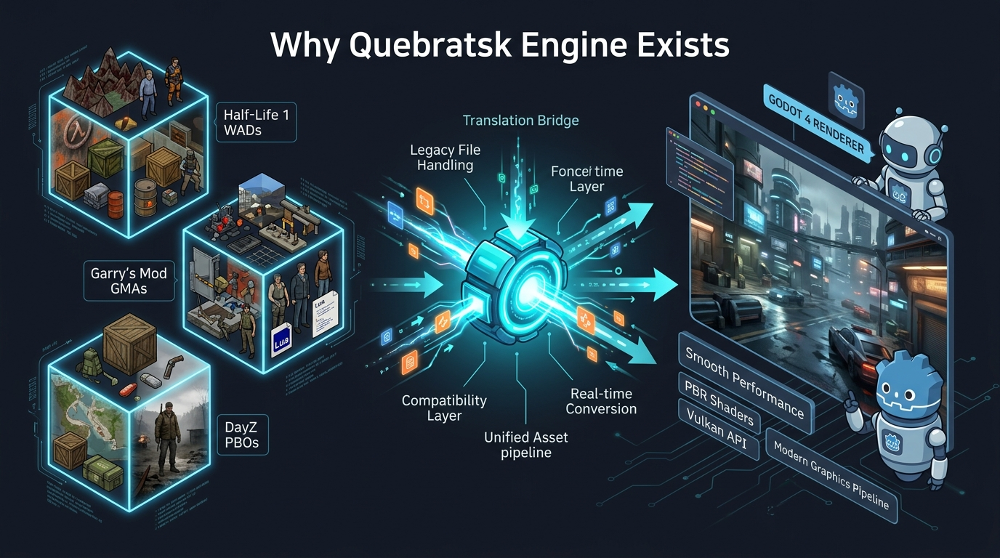

<p align="center">
  
</p>

<h1 align="center">Quebratsk Engine Subsystem</h1>

<p align="center">
  Universal asset ingestion subsystem for Godot 4 built with GDExtension and C++20. Reads assets from GoldSrc, Source Engine 1, and Real Virtuality / Enfusion in real time with zero-copy RAM mapping.
</p>

<p align="center">
  <a href="LICENSE"></a>
  <a href="https://godotengine.org"></a>
  <a href="https://en.cppreference.com/w/cpp/20"></a>
</p>

---

## 🎯 Why Quebratsk Engine Exists

<p align="center">
  
</p>

### The Problem: Decades of Great Content Trapped in Legacy Formats
Over the past 25 years, game modding communities have built millions of incredible 3D models, maps, weapons, vehicles, and animations across legendary engines like **GoldSrc** (*Half-Life*, *Counter-Strike*), **Source Engine 1** (*Garry's Mod*, *Team Fortress 2*), and **Real Virtuality** (*DayZ*, *Arma*).

However, independent developers moving to modern open-source engines like **Godot 4** face a frustrating barrier:
- **Painful Manual Re-Authoring:** Importing legacy assets requires hundreds of hours of manual work in Blender to fix broken UVs, inverted winding orders, incorrect $Z$-Up axes, and proprietary texture formats (`.paa`, `.vtf`).
- **No Native Modding / UGC Support:** Modern games cannot easily let players load classic Garry's Mod `.gma` packages or Arma `.pbo` mods on the fly without writing custom C++ parsers from scratch.

### The Solution: A Zero-Copy Universal Memory Bridge
**Quebratsk Engine** solves this problem at the C++ subsystem level. Instead of forcing developers to manually convert files on disk, Quebratsk mounts container archives (`.wad`, `.gma`, `.pbo`) directly into memory using cross-platform memory mapping (`mmap`).

It translates binary formats into a standardized **Intermediate Representation (IR)** and converts them in real time into native Godot 4 nodes (`ArrayMesh`, `Skeleton3D`, `StandardMaterial3D`, `HeightMapShape3D`).

**Key Goals:**
1. **Accelerate Indie Prototyping:** Build games in Godot 4 using existing asset libraries immediately without initial modeling bottlenecks.
2. **Enable Player Modding (UGC):** Allow your game's players to load custom community mods directly inside your compiled game.
3. **Digital Preservation:** Keep iconic game modding assets usable and alive in modern open-source game development.

---

## About This Project & AI Transparency

This repository is developed in pair-programming mode using **Claude Code** and **Google Antigravity IDE**. 

We choose to be 100% transparent about AI assistance. Open-source developers are rightly skeptical of low-effort "AI slop" projects that generate unverified code and flood repositories with broken boilerplate. 

Quebratsk Engine takes the opposite path:
- **Architected by humans**: Format specs, memory layouts, and conversion math are verified against authoritative engine references.
- **Strict C++20 standards**: Code uses memory-mapped I/O, `#pragma pack(push, 1)` structs validated with `static_assert`, zero-copy `std::span` buffers, and zero-allocation pipelines.
- **Active and iterative**: Features ship incrementally with clear commits, tested binary parsers, and explicit CHANGELOG records.

---

## 🗺️ Project Roadmap & Future Vision

<p align="center">
  
</p>

### Phase Breakdown & Expansion Vision

```
[ Phase 1: VFS Core (Done) ] ──► [ Phase 2: IR & Math (Done) ] ──► [ Phase 3: Classic Engine Parsers (Done) ]
                                                                                   │
                                                                                   ▼
[ Future Tier 2: Tarkov / Unity ] ◄── [ Future Tier 1: CS2 & Reforger ] ◄── [ Phase 4: Native Godot Converters (Done) ]
```

#### Current Milestones
- [x] **Phase 1: VFS Zero-Copy Core** — Memory mapping (`mmap`), URI scheme, WAD3/GMA/PBO mounting, LZSS CPRS decompressor.
- [x] **Phase 2: Intermediate Representation & Spatial Math** — `IRMeshData`, `IRSkeletonData`, `IRMaterialData`, $Z$-Up $\to$ $Y$-Up axis remapping, Hammer Unit scaling, CW $\to$ CCW winding inversion.
- [x] **Phase 3: Classic Engine Parsers** — GoldSrc (`.wad`, `.bsp`, `.mdl`, `.spr`), Source 1 (`.gma`, `.bsp`, `.mdl`, `.vtf`, `.vmt`), Real Virtuality (`.pbo`, `.p3d`, `.wrp`, `.paa`, `.rvmat`).
- [x] **Phase 4: Native Godot 4 Converters** — `MeshConverter`, `SkeletonConverter`, `MaterialConverter`, `AnimationConverter`, `CollisionConverter`, `TerrainConverter`.
- [ ] **Phase 5: Unified GDScript API** — `UnifiedAssetImporter` class bound to ClassDB.

#### Future Target Expansions (Tier 1 & 2 Roadmap)
1. **Enfusion Engine / Arma Reforger Support** (`.pak`, `.edds`)
2. **Source Engine 2 / Counter-Strike 2 (CS2) Support** (`.vpk_c`, `.vmdl_c`, `.vtex_c`)
3. **Unity / Escape from Tarkov Asset Support** (`.bundle`)

---

## Supported Engine Formats (Current Scope)

| Engine | Archive / VFS | Models & Animations | Textures & Materials | Physics & Terrains |
| :--- | :--- | :--- | :--- | :--- |
| **GoldSrc** *(Half-Life 1, CS 1.6)* | `.wad` (WAD3) | `.mdl` (StudioMDL v10), `.spr` | 8-bit palette textures, `.spr` frames | `.bsp` v30 ClipNodes |
| **Source Engine 1** *(GMod, HL2, CS:S)* | `.gma` (GMAD), `.vpk` | `.mdl` (v44–49), `.vtx`, `.vvd` | `.vtf` (v7.0–7.5), `.vmt` (KeyValues) | BSP Brushes, V-HACD |
| **Real Virtuality / Enfusion** *(DayZ SA, Arma 2/3)* | `.pbo` (CPRS LZSS) | `.p3d` (ODOL v40–v75+, MLOD) | `.paa` / `.pac` (DXT/ARGB), `.rvmat` | `.wrp` Heightmaps, P3D Geometry LODs |

---

## GDScript Example

```gdscript
extends Node3D

var vfs: QuebratskVFS
var importer: UnifiedAssetImporter

func _ready() -> void:
    vfs = QuebratskVFS.new()
    importer = UnifiedAssetImporter.new()
    importer.set_vfs(vfs)

    # Mount archives
    vfs.mount_container("vfs://cs16/", "res://assets/packages/cstrike.wad")
    vfs.mount_container("vfs://gmod/", "res://assets/packages/weapon_pack.gma")
    vfs.mount_container("vfs://dayz/", "res://assets/packages/weapons_firearms.pbo")

    # Load weapon mesh from Garry's Mod
    var weapon_mesh: ArrayMesh = importer.load_mesh("vfs://gmod/models/weapons/w_snip_awp.mdl")
    var weapon_instance := MeshInstance3D.new()
    weapon_instance.mesh = weapon_mesh
    add_child(weapon_instance)
```

---

## License

Quebratsk Engine is released under the [MIT License](LICENSE).
